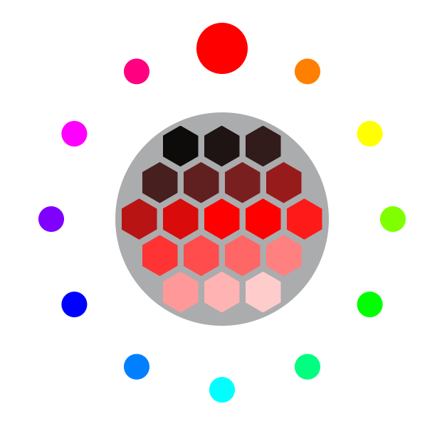
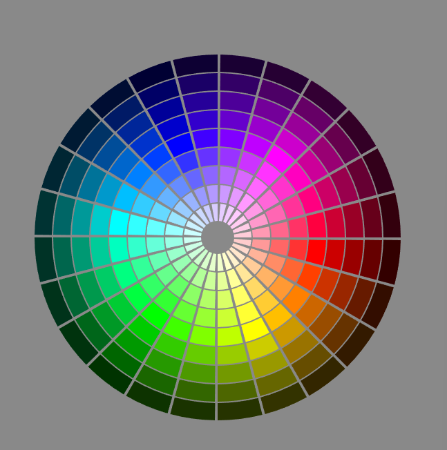

# Color Palette

## Description

Made for use with web design and any other design project that messes with colors and may need the same color just slightly different.

Provide a short description explaining the what, why, and how of your project. Use the following questions as a guide:

- What was your motivation?
- To Make something for later use in projects in design and web development where I will need to be dealing with color.
- I kept stumbling upon and using the same websites for color palettes and thought I could make something more usfull and for my needs.
- I have always been interested in color theory and using it with my design work and I felt like I haven't really found the right tool for the job. So I decided that I would make one that could fit anyone's needs.
- Why did you build this project? (Note: the answer is not "Because it was a homework assignment.")
- I Wanted to challenge myself and give a good go at some OOP in JavaScript.
  - Making My own Faux React App
  - Creating base Classes and helperClasses.
- What problem does it solve?
- I Was Having a huge problem with the way I wanted it to be styled and layed out.
  - First there was the problem of having A circular design that i wanted and had to do a lot of research on plotting points on a circle to figure out the correct coordinates.
  
    
  - Then I decided that my original Idea was good and all but I liked the look of a classic Color Wheel Design.
  
    
  - So This then really gave me More problems than I was looking for, but I was up for the challenge.
    - First, I decided to make them svg circles and have a dash offset to make the Individual pieces which made more problems with the hover effect I wanted to add which later gave more problems down the line.
    - So, in order to solve that i found a stack overflow forum about svg paths and seeing people making pie slices with those. So I decided that was the way to go for this project.
      - This Needed me to calculate each point for each corner of each individual piece. thank goodness finding equations for ploting points on a circle can be found in a lot of different places online just adapting it to my needs was the problem.
    - Then I decided to make it all dynamic and called on one single function call, so I created an object with multiple functions.
    - Now you can change the size, slices, thickness, strokeWidth, and it will all update dynamically.
- What did you learn?
- 

## Usage

### Color Format

On the Bottom of the site there is a color format select, and you can use that to change the color format that you would like to be copied to you clipboard.

  ##### Current Supported Color Formats
  
    - HEX
    - RGB
    - HSL

  ##### Current Color Formats Being Worked On adding
  
    - HSV
    - CMYK
    - HSB
    - HSI
    - HWB
    - Decimal

## License

Refer to LICENCE file in Repository

## How to Contribute

If you created an application or package and would like other developers to contribute it, you can include guidelines for how to do so. The [Contributor Covenant](https://www.contributor-covenant.org/) is an industry standard, but you can always write your own if you'd prefer.
